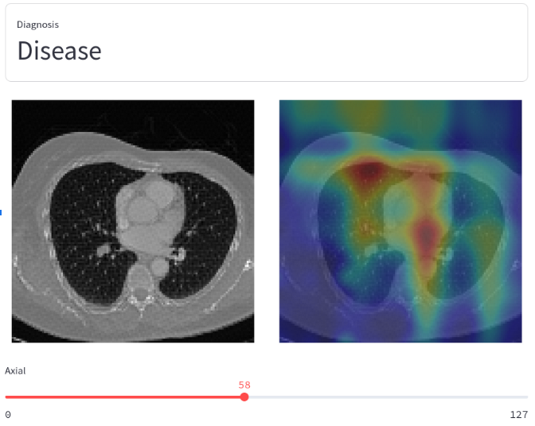

# 🧠 X2CT-MMe3D

**X2CT-MMe3D** is an AI pipeline for pulmonary disease diagnosis that leverages synthetic 3D CT volumes generated from paired chest X-rays.  
It builds on [PerX2CT (arXiv:2303.05297)](https://arxiv.org/abs/2303.05297) and introduces:

- A **multimodal architecture (MMe3D)** that learns from synthetic CTs and radiology reports  
- A complete **diagnosis pipeline** using 3D convolutional networks  
- A **FastAPI backend**, a **Streamlit demo**, and tools for data preprocessing, training, and inference  

> **Goal**: Investigate whether **synthetic CT volumes** — inferred from frontal and lateral X-rays — can enhance diagnosis when real CTs are unavailable.


> [!NOTE]
> CT generation at inference currently supports **CPU only** due to PerX2CT constraints. GPU acceleration is not yet available.

---

## 📚 Table of Contents

1. [Project Overview](#-project-overview)  
2. [Installation & Setup](#-installation--setup)  
3. [Dataset Preparation](#-dataset-preparation)  
4. [Model Training](#-model-training)  
5. [Running the API](#-running-the-api)  
6. [Running the Streamlit Demo](#-running-the-streamlit-demo)  
7. [Results & Evaluation](#-results--evaluation)  
8. [Project Structure](#-project-structure)  

---

## 🧩 Project Overview

- **Input**: Frontal and lateral chest X-rays + associated radiology report  
- **Output**: Disease prediction using synthetic CTs and 2D inputs  
- **Components**:  
  - PerX2CT: CT volume synthesis from X-rays  
  - MMe3D: Multimodal classifier (X-rays + synthetic CTs)  
  - Streamlit demo + FastAPI server  

---

## 🛠️ Installation & Setup

### 1. Clone the repository

```bash
git clone https://github.com/your-repo/X2CT-MMe3D.git
cd X2CT-MMe3D
```

### 2. Download Model Checkpoints

From [Google Drive](https://drive.google.com/drive/folders/1wbhBSwKUv_Co5oI2Z8uKbEDQYTB9N5p6?usp=sharing):

```
models/
└── checkpoints/
    └── 2-x2ct-20250604_215106

perx2ct/
└── checkpoints/
    └── PerX2CT.ckpt
```

### 3. Install Dependencies

Create a conda environment and install dependencies:

```bash
conda create -n med python=3.10 -y
conda activate med
pip install -r requirements.txt
```

Set up PerX2CT as per `perx2ct/README.md`.

---

## 📊 Dataset Preparation

### 1. Download Dataset

Get the [Indiana Chest X-rays dataset](https://www.kaggle.com/datasets/raddar/chest-xrays-indiana-university) and place the files like so:

```
data/raw/
├── indiana_reports.csv
├── indiana_projections.csv
└── images/
    └── ... (X-ray images)
```

### 2. (Optional) Generate Train/Test Splits

```bash
python generate_csv.py
```

Outputs:
- `data/processed/indiana_reports.train.csv`  
- `data/processed/indiana_reports.test.csv`  

### 3. Generate Synthetic CT Volumes

```bash
python generate_synthetic_volumes.py \
  --save_dir ./data/synthetic_cts \
  --projection_dir ./data/raw/images \
  --csv_reports_path ./data/processed/indiana_reports.csv \
  --csv_projections_path ./data/processed/indiana_projections.csv
```

### 4. Preprocess Synthetic CTs

```bash
python preprocess_ct.py \
  --save_dir ./data/processed_cts \
  --ct_dir ./data/synthetic_cts \
  --csv_reports_path ./data/processed/indiana_reports.csv \
  --csv_projections_path ./data/synthetic_cts/projections_synth.csv
```

---

## 🚀 Model Training

Train the multimodal diagnosis model:

```bash
python train.py \
  --reports ./data/processed/indiana_reports.train.csv \
  --projections ./data/processed/indiana_projections.csv \
  --xrays ./data/raw/images \
  --cts ./data/processed_cts \
  --model-dir ./models/checkpoints \
  --batch-size 8 --epochs 30 --lr 1e-3 \
  --weight-decay 1e-3 --test-size 0.1 \
  --patience 10 --scheduler-patience 8 \
  --pretrained --wandb --baseline False \
  --model-prefix x2ct_mme3d_model
```

### SLURM Training Scripts

- `hpc/train.slurm`: X2CT-MMe3D  
- `hpc/train.baseline.slurm`: BiplanarCheXNet baseline  

---

## 🐳 Running the API

### Option 1: Docker

```bash
docker build -f docker/Dockerfile -t med:latest .
docker run -p 8000:8000 med:latest
```

> 💡 On macOS, try `Dockerfile.macos` if needed.

### Option 2: Manual (Local)

```bash
python PYTHONPATH=. api/main.py \
  --port 8000 \
  --checkpoint ./models/checkpoints/resnet18_20250523_084333_epoch13.ckpt \
  --perx2ct_python_path <path_to_perx2ct_python> \
  --perx2ct_config_path ./perx2ct/PerX2CT/configs/PerX2CT.yaml \
  --perx2ct_model_path ./perx2ct/PerX2CT/checkpoints/PerX2CT.ckpt
```

> Replace `<path_to_perx2ct_python>` with the PerX2CT environment Python path.

### Access the API

- Root: `http://localhost:8000`  
- Swagger UI: `http://localhost:8000/docs`  

---

## 🎛️ Running the Streamlit Demo

Launch an interactive tool for uploading X-rays, running inference, and viewing 3D slices.

### 1. Make sure the API is running

Start it via Docker or manual mode (see above).

### 2. Start Streamlit App

```bash
streamlit run app.py
```

### 3. Interact

1. Upload **frontal** and **lateral** X-rays  
2. Click **Submit**  
3. View diagnosis + axial/sagittal/coronal slices  

> **Note:** Demo expects `.npy` files with shape `128×128×128`.



---

## 📈 Results & Evaluation

### Training Comparison


- **Red**: Baseline (2D X-rays only)  
- **Blue**: X2CT-MMe3D (X-rays + synthetic CTs)

> During training, X2CT-MMe3D achieves consistently higher mean AUC and lower variance.

### 🔬 Statistical Evaluation

| Metric     | Baseline (X-rays) | X-rays + CTs (Ours) | Δ Improvement | 95% CI       | p-value  |
|------------|-------------------|---------------------|---------------|--------------|----------|
| F1 Score   | 0.61              | **0.68**            | **+0.07**     | (0.03, 0.12) | < 0.001  |
| ROC AUC    | 0.80              | **0.83**            | **+0.03**     | (0.01, 0.05) | < 0.001  |

- 30 training runs per model  
- Bootstrapped test samples (10,000)  
- Significant improvements in diagnostic performance  

---

## 🗂️ Project Structure

```bash
X2CT-MMe3D/
├── api/                  # FastAPI server
├── data/                 # Raw, processed, synthetic datasets
├── docker/               # Dockerfiles
├── models/               # Trained checkpoints
├── perx2ct/              # CT generation model (PerX2CT)
├── scripts/              # Preprocessing utilities
├── train.py              # Main training script
├── app.py                # Streamlit demo
└── requirements.txt      # Python dependencies
```

---

## 📬 Contact & Credits

Built on [PerX2CT](https://github.com/dek924/PerX2CT)  
Developed for multimodal learning and clinical research in resource-constrained settings.
